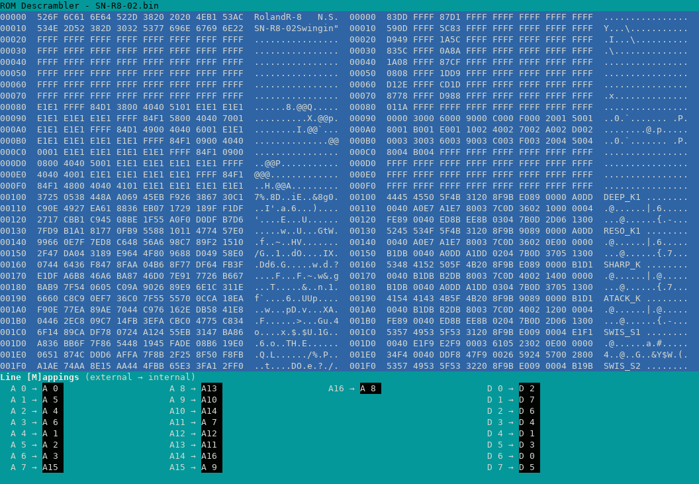

# ROM Descrambling Utility

This is a small tool that helps decoding ROMs that have their address and data lines swapped.

It allows you to remap address and data lines.
Changes are shown in realtime using a hex+ASCII view, allowing for WYSIWYG decoding.



## Usage

```sh
rom-descrambler input.bin
```

The tool will then open its main window.

### Keys

Global keys:

- `O` - show Options dialog
- `S` - show "Save descrambled data" dialog
- `Q` - quit

Hex view:

- cursor keys: scrolling (up/down: 1 line, left/right: 1 byte)
- page up/down: scroll up/down by 1 page
- home/end: jump to beginning/end of the file
- `+`/`-` - increase/decrease number of bytes per line
- `G` - show Go To Offset dialog
- `V` - change view mode (original, descrambled, side-by-side)
- `M` - go to Line Mappings

Line mappings:

- cursor keys - nagivate between address/data line mappings
- 'A' + number - jump to address line
- 'D' + number - jump to data line
- `R` - reverse all mappings
- `0`..`9` - change value (confirm by moving or Return, cancel using ESC)
- `+`/`-` - increase/decrease value
- ESC - go back to hex view

## Compiling

In order to compile the tool, you will need CMake and NCurses.
(PDCurses should also work.)

On Debian, this would be the following packages:

- `cmake`
- `libncurses-dev`

## Various notes

Thanks to <https://github.com/mrdudz/unidec> for the inspiration for this tool.
